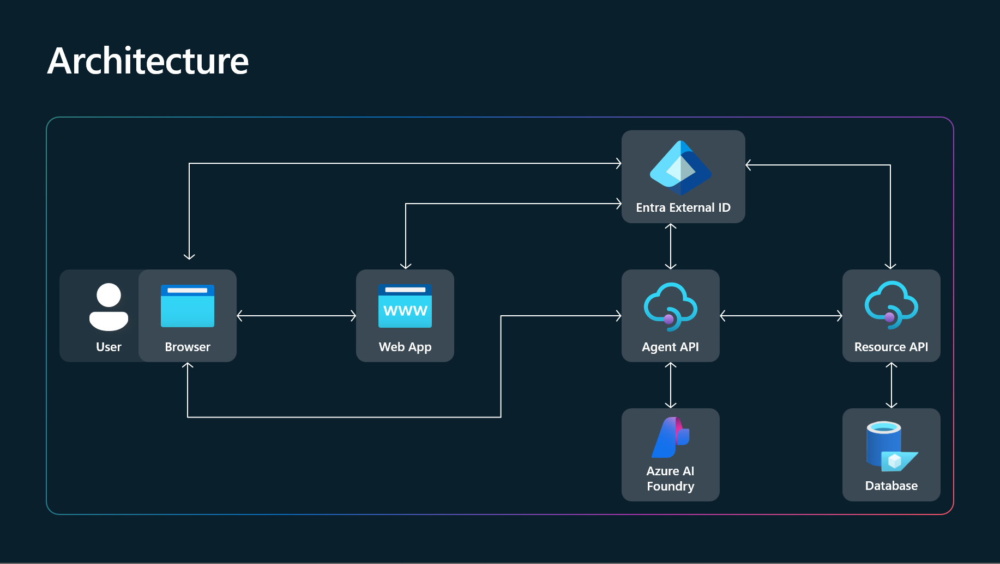

# Build2025-BRK231-demo
Microsoft Build 2025 の BRK231 で共有されたリポジトリ https://github.com/microsoft/Build25-BRK231 を手元で少し修正。

## 内容
Woodgrove Groceries という架空の EC サイトを構築する。アーキテクチャはこちら。データベースに関しては今回実装はしないがファイルでデータを持たせておく。

## 目的
- ローカル環境でしか実行できないものを Azure App Service (WebApp) 上にデプロイし、テスト用の Web アプリケーションとしてデプロイする。
- 認証プロバイダーとしては Microsoft Entra External ID を利用する想定。（Easy Auth をそのままつかってもいいのだが、勉強のため敢えて利用しない。）
- アーキテクチャの図にあるように、Microsoft Entra External ID のトークン/クレームを使い、AgentAPI が WoodgroveGroceriesAPI に対して OBO(On-Behalf-Of)認証を行ってユーザーに代わりショッピングカートの更新や商品の検索を行えるようにする。

